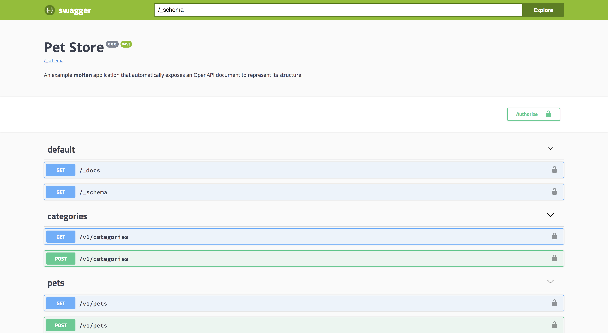

# OpenAPI Example

An example demonstrating the use of `molten.openapi`.

## Usage

Install molten with `pip install -e '.[dev]'` then run the app with
`gunicorn app:app`.  Finally, visit http://127.0.0.1/_docs in a web
browser.  You should see something like this:

